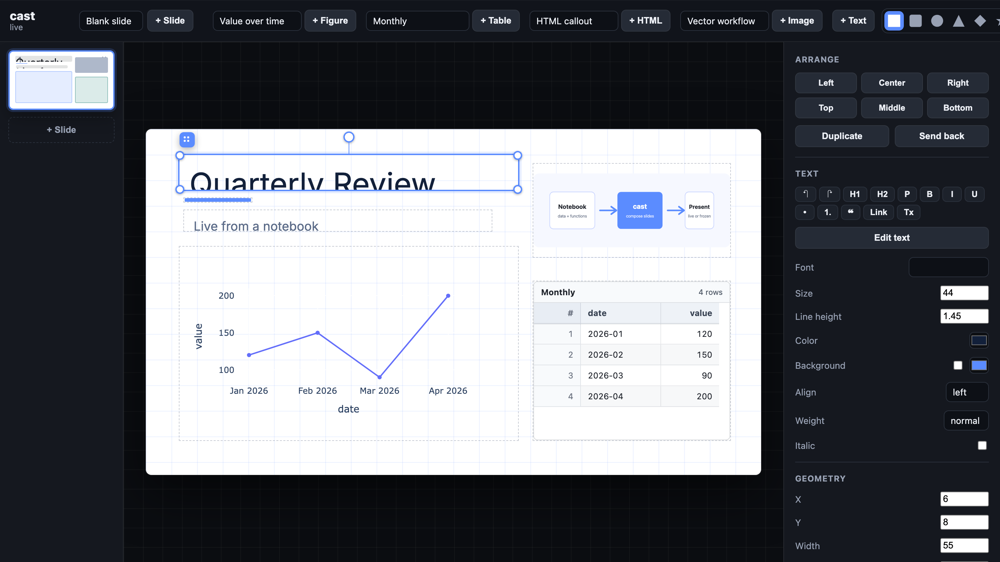

# cast

Build live, notebook-backed presentations from Python functions.




*The cast editor — a Plotly figure, a scrollable data table, a vector image, and rich text arranged on the canvas, with the selected block's controls in the inspector. Every asset comes from a decorated notebook function.*

**Project note:** This repo is vibe coded, and the frontend in particular — the
in-browser canvas editor and everything it renders — was built by iteration
rather than by a dedicated frontend engineer. It is experimental and
fast-moving, so expect rough edges alongside the parts that work well.

## What it does

The usual path from analysis to slides means exporting a chart, pasting it into
a deck, and repeating the whole process whenever the data changes. cast removes
that step. You decorate the functions you have already written, and they become
building blocks on a live web canvas. You arrange those blocks, add text,
images, and shapes, and present — and when the underlying data changes, the
slides update without a reload.

```python
import cast, polars as pl, plotly.express as px

cast.serve()                       # live editor in a background thread

@cast.data                         # returns a polars LazyFrame -> a data source
def sales():
    return pl.scan_parquet("sales.parquet")

@cast.figure                       # a factory: takes one table, returns a Plotly figure
def trend(tbl):
    df = tbl.select(["month", "revenue"]).collect()
    return px.line(df, x="month", y="revenue", markers=True)

sales()                            # register the table, then build the deck in the browser
```

That is the entire program. Open the printed URL, add the `trend` figure with
the `sales` table, and it appears on a slide.

## Install

```bash
pip install cast-func
```

cast requires Python 3.9 or newer. The runtime dependencies — `fastapi`,
`uvicorn`, `polars`, `plotly`, `numpy`, `pandas`, `pyarrow`, and `notebook` —
are installed automatically. The package is imported as `cast`:

```python
import cast
```

## The decorators

Everything on a slide begins as a decorated function in the notebook.
Registration is a side effect of *calling* the function (for `@data`) or of
*defining* it (for the factories), and each decorated function still returns its
original value, so existing notebook code is unaffected. Every decorator
supports both the bare form (`@cast.data`) and the parameterized form
(`@cast.data(name=..., title=...)`).

| Decorator | The function returns | Registered as |
| --- | --- | --- |
| `@cast.data` | a `polars.LazyFrame` | a data source that feeds figures and table blocks |
| `@cast.figure` | *(factory)* a Plotly figure from a table | a chart that can be rebound to any table |
| `@cast.html` | an HTML string (or an object with `_repr_html_`) | a sandboxed iframe block |
| `@cast.image` | a path, bytes, SVG, or data URI | an original-quality image asset |

### `@cast.data`

```python
@cast.data
def sales():
    return pl.scan_parquet("sales.parquet")

@cast.data(title="Q2 Forecast")
def forecast():
    return pl.scan_parquet("forecast.parquet")
```

Calling the function registers the table. Calling it again with new data updates
every slide that uses it, live, with no reload or re-export. Data sources feed
both figures and table blocks. Table blocks render with sticky column headers,
horizontal and vertical scrolling, optional row numbers and stripes, and a
preview limit of up to 1,000 rows; the same scrollable table is preserved in
present mode and in exports.

### `@cast.figure`

```python
@cast.figure(title="Value over time")
def trend(tbl):
    df = tbl.select(["date", "value"]).collect()
    return px.line(df, x="date", y="value", markers=True)
```

`@cast.figure` registers a *factory* at decoration time, not a rendered chart —
you do not pass a table in the notebook. In the browser you add the figure to
the inventory and choose which table feeds it, and you can add the same factory
again with a different table. Each instance has its own table dropdown; picking a
table re-runs the figure function on the server against that data. If the chosen
table is incompatible, the block shows the error inline and invites another
choice rather than crashing.

### `@cast.html`

```python
@cast.html(title="Callout")
def callout():
    return "<h2>Custom HTML</h2><button onclick=\"this.textContent='clicked'\">Click</button>"
```

`@cast.html` registers a custom HTML object at decoration time. Add it from the
HTML dropdown to insert the returned markup into a sandboxed iframe block. This
is useful for small widgets, controls, styled notes, or visualization snippets
that are not Plotly figures. Objects exposing `_repr_html_()` are also accepted.

### `@cast.image`

```python
from pathlib import Path

@cast.image(title="Study design", alt="Diagram of the study workflow")
def study_design():
    return Path("figures/study-design.svg")  # PNG, JPEG, bytes, SVG, and data URIs also work
```

`@cast.image` registers publication-quality image assets at decoration time. The
function may return a PNG/JPEG/SVG file path, raw image bytes, SVG markup, a data
URI, or a notebook object with a PNG, JPEG, or SVG rich representation;
Matplotlib figures and Pillow images are accepted through their standard save
methods. The live app serves the original bytes without resizing or
recompression, so SVG remains vector and raster images keep their full
resolution. The inspector provides contain/cover/stretch behavior, a source
aspect-ratio action, smooth/crisp/pixel rendering, transparency, alt text,
corner radius, and opacity.

## Composing the deck

Once assets are registered, the browser is a free-form canvas:

- Figures, tables, HTML, images, text, and shapes (rectangle, ellipse, triangle,
  line) can be placed anywhere on a 16:9 canvas.
- Blocks can be dragged, resized from any corner, rotated, and stacked in z-order;
  arrow keys nudge the selection and the Delete key removes it.
- Text boxes use slide-native rich text rather than Markdown. Editing happens on
  the same element used for presentation, so typography, wrapping, and spacing do
  not change between design and present modes; font, size, color, weight,
  alignment, and line height are set in the inspector, and double-clicking a text
  block edits it in place.
- A theme sets accent, background, foreground, and font once for the whole deck.
- Edits stream over Server-Sent Events, so multiple tabs and changing data stay
  in sync.
- Present mode is full-screen with arrow-key navigation, and figures remain
  interactive.

The editor is served by the small FastAPI application that `cast.serve()` starts
in a background thread. `serve()` is idempotent, so calling it more than once
does not start a second server.

## Save, reopen, and export

```python
cast.save("talk.cast.json")   # editable source: slides, text, geometry, styles, theme, asset references
cast.load("talk.cast.json")   # reopen it later, after the asset cells have re-registered
cast.freeze("talk.html")      # one self-contained HTML file, no server required
```

`save` and `load` round-trip an editable deck as human-readable JSON. The
document preserves slide order, text, geometry, styles, rotations, theme,
manually uploaded images, and references to decorated assets. It deliberately
does not serialize Python functions or data frames; rerun the notebook cells that
define those assets before reopening the deck. The same **Save** and **Open**
actions are available from the editor toolbar.

`freeze` produces the shareable output: figures are pre-rendered to Plotly JSON,
images are embedded, and tables, text, and shapes are inlined into a single HTML
file with client-side slide navigation and still-interactive charts. It needs no
running server.

## How it fits together

```
   NOTEBOOK  ->  decorate functions  ->  ASSET LIBRARY  ->  compose on the CANVAS  ->  present / freeze
  (your data)    @data @figure           (tables, figures,   (arrange, style, theme)    (live or portable)
                 @html @image             html, images)
```

The notebook is the source of truth for data and logic; the browser is the source
of truth for layout. cast keeps the two in sync.

## Run the example

```bash
python examples/demo.py
```

Then open <http://127.0.0.1:8000>. Add the `trend` figure with the `monthly`
table, add it again with `daily`, try the deliberately incompatible `wide` table
to see the inline error, and add the HTML callout and the vector workflow image.
The full source is in [`examples/demo.py`](examples/demo.py).

## API reference

| Call | Description |
| --- | --- |
| `cast.serve(port=8000, host="127.0.0.1", open=False)` | Start the editor in a background thread and return the URL; `open=True` embeds an IFrame in a notebook. Idempotent. |
| `@cast.data` / `@cast.data(name=, title=)` | Register a `LazyFrame`-returning function as a data source. |
| `@cast.figure` / `@cast.figure(name=, title=)` | Register a `table -> Plotly figure` factory. |
| `@cast.html` / `@cast.html(name=, title=)` | Register an HTML-returning factory for iframe blocks. |
| `@cast.image` / `@cast.image(name=, title=, alt=)` | Register an original-quality image asset. |
| `cast.save(path)` | Write the editable `.cast.json` deck. |
| `cast.load(path)` | Restore an editable deck (register the assets first). |
| `cast.freeze(path)` | Export a self-contained, portable HTML file. |

## Notes and limitations

- The frontend is vibe coded and still settling; some interactions are rough.
- The page is built at import time. If you edit `cast/templates.py`, restart the
  kernel or process to see the change — a browser refresh alone will not reload it.
- `save` and `load` store references to decorated assets, not the Python behind
  them. Rerun the notebook cells that define the assets before calling `load`.

## License

MIT. See [LICENSE](LICENSE).
